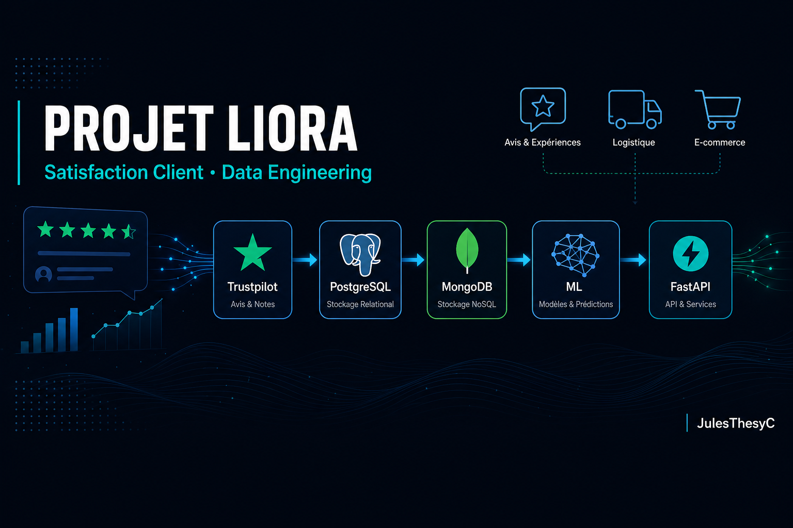

<p align="center">
  
</p>

<h1 align="center">PROJET LIORA — Satisfaction Client</h1>

<p align="center">
  <a href="https://github.com/JulesThesyC"></a>
  <a href="https://github.com/JulesThesyC/PROJET-LIORA-Satisfaction-Client"></a>
</p>

<p align="center">
  
  
  
  
  
  
  
  
  
</p>

<p align="center">
  <strong>Pipeline Data Engineering complet</strong> — collecte Trustpilot, bases de données, ML sentiment, API, dérive & orchestration journalière.
</p>

---

## Entreprises analysées

| | Entreprise | Domaine | Thème |
|---|------------|---------|-------|
| 🛒 | **Amazon FR** | [www.amazon.fr](https://fr.trustpilot.com/review/www.amazon.fr) | E-commerce |
| 📦 | **Chronopost FR** | [www.chronopost.fr](https://fr.trustpilot.com/review/www.chronopost.fr) | Logistique |
| 🚗 | **Tesla FR** | [tesla.com](https://fr.trustpilot.com/review/tesla.com) | Automobile |
| 🛍️ | **Temu FR** | [temu.com](https://fr.trustpilot.com/review/temu.com) | E-commerce |

**Données :** infos société · notes TrustScore · avis utilisateurs · réponses entreprise

## Documentation

| Document | Format |
|----------|--------|
| [**Rapport global (soutenance)**](docs/rapport_global.md) | Markdown |
| [**Rapport global (PDF)**](docs/rapport_global.pdf) | PDF téléchargeable |
| [Traitement des données](docs/traitement_donnees.md) | Méthode scraping |
| [Kibana](docs/kibana_setup.md) | Dashboard |
| [Dérive des données](docs/rapport_drift.md) | Monitoring ML |

```powershell
# Régénérer le PDF du rapport
python scripts/export_rapport_pdf.py
```

## Structure

```
PROJET_LIORA/
├── config/companies.yaml      # Configuration entreprises
├── src/liora/
│   ├── scraper/               # Web scraping Playwright
│   ├── etl/                   # PostgreSQL, MongoDB, ES
│   ├── ml/                    # Sentiment + MLflow + drift
│   └── api/                   # FastAPI
├── sql/                       # Schéma & requêtes PostgreSQL
├── notebooks/                 # Analyse sentiment
├── airflow/dags/              # Pipeline journalier
├── docs/assets/               # Bannière & visuels
├── data/raw/                  # CSV exportés
└── docker-compose.yml
```

## Installation

```powershell
git clone https://github.com/JulesThesyC/PROJET-LIORA-Satisfaction-Client.git
cd PROJET-LIORA-Satisfaction-Client
python -m venv .venv
.\.venv\Scripts\Activate.ps1
pip install -r requirements.txt
python -m playwright install chromium
copy .env.example .env
```

## Pipeline local (sans Docker)

```powershell
$env:PYTHONPATH = ".\src"
.\scripts\run_pipeline.ps1 -MaxReviews 80
```

Étapes : scrape → PostgreSQL → Mongo/ES → train ML → drift.

## Docker (production-like)

```powershell
docker compose up -d postgres mongodb elasticsearch kibana mlflow api
docker compose --profile scrape run scraper
```

| Service        | URL                    |
|----------------|------------------------|
| API Swagger    | http://localhost:8000/docs |
| Kibana         | http://localhost:5601  |
| MLflow         | http://localhost:5000  |
| PostgreSQL     | localhost:5432         |

## API — exemples

```http
GET  /health
GET  /companies
GET  /reviews/stats/amazon_fr
POST /predict/sentiment  {"texts": ["Livraison rapide, très satisfait"]}
POST /monitoring/drift
```

## Auteur
**Auteur** — Jules COLONAS

**Profil LinkedIn** — **[Jules COLONAS](https://www.linkedin.com/in/julescolonas)**

**[JulesThesyC](https://github.com/JulesThesyC)** — Data Engineer


## Licence & usage

Projet académique. Respecter les [conditions Trustpilot](https://fr.trustpilot.com) pour tout déploiement réel.
