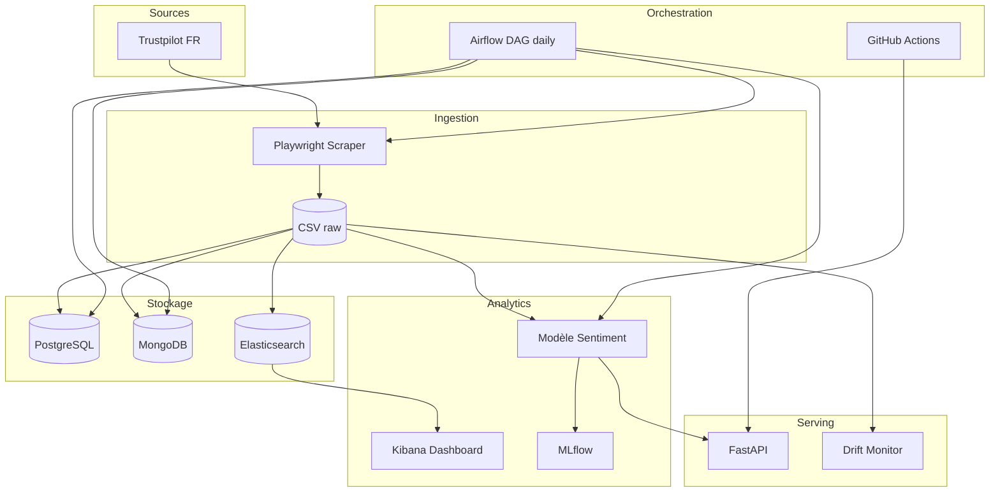
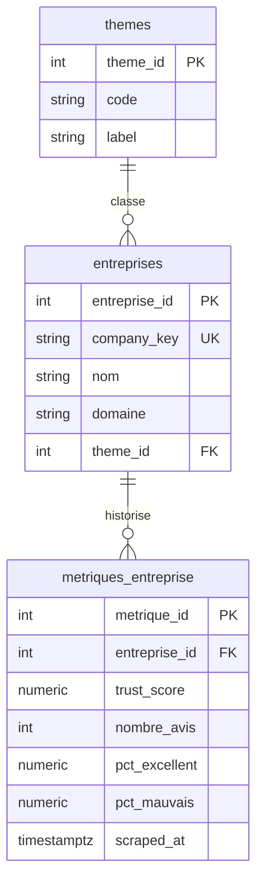
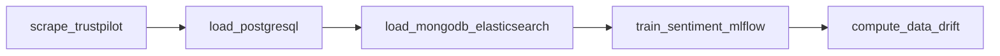

# Rapport global — Projet LIORA  
## Satisfaction client & Supply Chain (Data Engineering)

**Auteur :** [JulesThesyC](https://github.com/JulesThesyC)  
**Date :** Mai 2026  
**Contexte :** Projet pédagogique — Web scraping, bases de données, ML, MLOps, API, Airflow  
**Source des avis :** [Trustpilot France](https://fr.trustpilot.com)

---

## Table des matières

1. [Introduction et objectifs](#1-introduction-et-objectifs)
2. [Périmètre et entreprises ciblées](#2-périmètre-et-entreprises-ciblées)
3. [Architecture globale](#3-architecture-globale)
4. [Étape 1 — Collecte des données](#4-étape-1--collecte-des-données)
5. [Étape 2 — Organisation et stockage](#5-étape-2--organisation-et-stockage)
6. [Étape 3 — Consommation (Machine Learning)](#6-étape-3--consommation-machine-learning)
7. [Étape 4 — Mise en production](#7-étape-4--mise-en-production)
8. [Étape 5 — Automatisation et CI/CD](#8-étape-5--automatisation-et-cicd)
9. [Étape 6 — Synthèse pour la soutenance](#9-étape-6--synthèse-pour-la-soutenance)
10. [Résultats chiffrés](#10-résultats-chiffrés)
11. [Difficultés et choix techniques](#11-difficultés-et-choix-techniques)
12. [Perspectives](#12-perspectives)
13. [Annexes et captures d’écran](#13-annexes-et-captures-décran)

---

## 1. Introduction et objectifs

### 1.1 Contexte métier

La **supply chain** couvre l’approvisionnement, la production et la distribution. En **aval**, la satisfaction client reflète souvent la qualité perçue de la livraison, du service après-vente, du rapport qualité/prix ou de la durabilité.

Les plateformes d’avis (dont **Trustpilot**) concentrent des **verbatim** essentiels, mais leur lecture manuelle ne scale pas. Ce projet LIORA (*Livraison, Insights, Opinions, Réputation, Analyse*) automatise le cycle complet **data engineering** :

| Objectif | Réponse apportée |
|----------|------------------|
| Mesurer la satisfaction | TrustScore, distribution des étoiles, volume d’avis |
| Comprendre les causes | Texte des avis + analyse de sentiment |
| Suivre la réactivité | Détection des réponses entreprise |
| Industrialiser | Pipeline journalier, API, monitoring, dérive |

### 1.2 Cahier des charges (6 étapes)

Le sujet impose six étapes : collecte (scraping → CSV), organisation (PostgreSQL + MongoDB + Kibana), ML (sentiment + MLflow), production (FastAPI + Docker + dérive), automatisation (Airflow + CI), soutenance (démonstration + rapport).

---

## 2. Périmètre et entreprises ciblées

Quatre entreprises françaises ont été sélectionnées, couvrant **e-commerce**, **logistique** et **automobile** :

| Clé | Entreprise | Domaine Trustpilot | Thème | Profil |
|-----|------------|-------------------|-------|--------|
| `amazon_fr` | Amazon FR | [www.amazon.fr](https://fr.trustpilot.com/review/www.amazon.fr) | E-commerce | Marketplace |
| `chronopost_fr` | Chronopost FR | [www.chronopost.fr](https://fr.trustpilot.com/review/www.chronopost.fr) | Logistique | Livraison express |
| `tesla_fr` | Tesla FR | [tesla.com](https://fr.trustpilot.com/review/tesla.com) | Automobile | Constructeur |
| `temu_fr` | Temu FR | [temu.com](https://fr.trustpilot.com/review/temu.com) | E-commerce | Marketplace discount |

### Données collectées par type

| Type | Contenu |
|------|---------|
| **a) Infos société** | Nom, domaine, pays, catégories, description, profil revendiqué, site web |
| **b) Notes** | TrustScore, étoiles, nombre total d’avis, % par classe (1 à 5 étoiles) |
| **c) Avis utilisateurs** | Titre, texte, note, dates, auteur, langue, badge vérifié |
| **d) Réponses entreprise** | Texte et date de réponse lorsqu’elles existent |

Configuration centralisée : `config/companies.yaml`.

---

## 3. Architecture globale



### Stack technique

| Couche | Technologies |
|--------|--------------|
| Scraping | Python 3.11+, Playwright, pandas |
| Relationnel | PostgreSQL 16, SQL |
| Document | MongoDB 7 |
| Recherche / viz | Elasticsearch 8.12, Kibana |
| ML | scikit-learn, MLflow, Jupyter |
| API | FastAPI, Uvicorn, Prometheus metrics |
| Conteneurs | Docker, Docker Compose |
| Orchestration | Apache Airflow 2.8 |
| CI | GitHub Actions |

---

## 4. Étape 1 — Collecte des données

### 4.1 Objectif

Extraire via **web scraping** :
1. Des **métriques agrégées** par entreprise (TrustScore, volumes, % par étoile).
2. Des **avis détaillés** avec indicateur de réponse entreprise.

**Livrables :** fichiers CSV + documentation (`docs/traitement_donnees.md`).

### 4.2 Méthode

Trustpilot bloque les requêtes HTTP simples (**403 Forbidden**). La solution retenue :

1. **Playwright** (Chromium headless) pour charger les pages comme un navigateur.
2. Extraction du JSON **`__NEXT_DATA__`** (application Next.js) : 20 avis par page.
3. **Pagination** via `?page=N` (jusqu’à `MAX_REVIEW_PAGES`).
4. **Distribution des étoiles** lue dans le DOM (`data-star-rating` + largeur CSS des barres).

**Module :** `src/liora/scraper/trustpilot.py`  
**Commande :**

```powershell
$env:PYTHONPATH = ".\src"
python -m liora.scraper.run_scraper --max-reviews 200
```

### 4.3 Fichiers produits

| Fichier | Description |
|---------|-------------|
| `data/raw/entreprises_trustpilot.csv` | 1 ligne par entreprise, métriques + % étoiles |
| `data/raw/avis_trustpilot.csv` | 1 ligne par avis + colonnes réponse |

### 4.4 Schéma des colonnes (extrait)

**Entreprises :** `company_key`, `trust_score`, `total_reviews`, `pct_5_stars` … `pct_1_stars`, `reply_percentage`, `categories`, `description` …

**Avis :** `review_id`, `title`, `text`, `rating`, `published_date`, `has_company_reply`, `company_reply_text`, `company_reply_date`, `verified`, `reviewer_name` …

### 4.5 Éthique et limites

- Délais entre pages (`delay_seconds`) pour limiter la charge serveur.
- Volume paramétrable (`MAX_REVIEWS_PER_COMPANY`) : échantillon analytique, pas miroir intégral (ex. Chronopost ~190k avis).
- Usage académique ; en production, vérifier les [CGU Trustpilot](https://fr.trustpilot.com) et l’[API officielle](https://developers.trustpilot.com).

---

## 5. Étape 2 — Organisation et stockage

### 5.1 Objectif

Structurer les données en **base relationnelle** (entreprises / métriques) et **base documentaire** (avis), avec **dashboard Kibana**.

### 5.2 Modèle relationnel PostgreSQL

Fichiers : `sql/schema.sql`, `sql/queries.sql`.



**Segmentation :**
- `themes` — ecommerce, logistique, automobile (comparaison supply chain).
- `entreprises` — identité stable.
- `metriques_entreprise` — snapshots datés (évolution TrustScore dans le temps).
- `entreprises_categorie` — optionnel, listes issues des pages catégories Trustpilot.

**Chargement :** `python -m liora.etl.load_postgres`

### 5.3 MongoDB (avis)

- Base : `liora_reviews`
- Collection : `reviews` (clé `_id` = `review_id`)
- Index : `company_key`, `rating`, `published_date`

**Chargement :** `python -m liora.etl.load_mongodb`

### 5.4 Elasticsearch + Kibana

- Index : `liora_reviews` (champs texte en français, filtres par entreprise).
- Guide dashboard : `docs/kibana_setup.md` (Discover, agrégations par note, taux de réponse, timeline).

**URL locale :** http://localhost:5601 (via `docker compose up -d elasticsearch kibana`).

### 5.5 Requêtes SQL de validation

Exemples dans `sql/queries.sql` :
- Synthèse des 4 entreprises avec dernières métriques.
- Entreprise la plus critique (% avis 1★).
- Comparaison par thème.

---

## 6. Étape 3 — Consommation (Machine Learning)

### 6.1 Objectif

Analyse de **sentiment** basique + **versioning** des modèles avec **MLflow**.

### 6.2 Approche

| Élément | Choix |
|---------|-------|
| Labels | Proxy depuis la note 1–5 (1–2 → négatif, 3 → neutre, 4–5 → positif) |
| Features | TF-IDF (1–2 grams, max 8000 features) |
| Modèle | Régression logistique (`class_weight=balanced`) |
| Métrique | F1 macro |

**Modules :** `src/liora/ml/sentiment.py`, `src/liora/ml/train.py`  
**Notebook commenté :** `notebooks/sentiment_analysis.ipynb`

### 6.3 MLflow

- Tracking URI par défaut : `mlruns/` (local) ou serveur Docker port 5000.
- Artefacts : modèle sklearn, rapport de classification, `sentiment_model.joblib`.

```powershell
$env:PYTHONPATH = ".\src"
python -m liora.ml.train
```

### 6.4 Interprétation

Sur l’échantillon de 160 avis, le modèle reflète fortement la polarisation des notes (majorité d’avis 1★). En production, enrichir avec :
- Modèles français (CamemBERT, etc.).
- Annotation manuelle d’un sous-ensemble.
- Features métier (thème, délai livraison mentionné dans le texte).

---

## 7. Étape 4 — Mise en production

### 7.1 API FastAPI

**Fichier :** `src/liora/api/main.py`

| Endpoint | Méthode | Rôle |
|----------|---------|------|
| `/health` | GET | Santé + modèle chargé |
| `/companies` | GET | Liste entreprises (CSV) |
| `/reviews/stats/{company_key}` | GET | Stats agrégées par entreprise |
| `/predict/sentiment` | POST | Prédiction sentiment sur textes |
| `/monitoring/drift` | POST | Calcul dérive des données |
| `/metrics` | GET | Métriques Prometheus |

**Documentation interactive :** http://localhost:8000/docs

### 7.2 Docker

- `src/liora/api/Dockerfile` — image API.
- `docker-compose.yml` — postgres, mongodb, elasticsearch, kibana, mlflow, api, scraper (profile).
- `docker/Dockerfile.scraper` — image Playwright pour collecte conteneurisée.

```powershell
docker compose up -d postgres mongodb elasticsearch kibana mlflow api
```

### 7.3 Mesure de la dérive

**Module :** `src/liora/ml/drift.py`  
**Rapport :** `docs/rapport_drift.md`, sortie `data/processed/drift_report.json`

| Indicateur | Seuil alerte |
|------------|--------------|
| PSI (distribution notes) | > 0,20 |
| Dérive longueur texte | > 15 % |
| Dérive taux de réponse | > 10 pts |

Permet de déclencher un ré-entraînement si le profil des avis change (crise livraison, campagne d’avis, etc.).

---

## 8. Étape 5 — Automatisation et CI/CD

### 8.1 DAG Airflow

**Fichier :** `airflow/dags/trustpilot_daily.py`  
**ID :** `liora_trustpilot_daily`  
**Planification :** `@daily`



**Lancement :**

```powershell
docker compose --profile airflow up -d
```

Interface : http://localhost:8080 (admin / admin).

### 8.2 CI GitHub Actions

**Fichier :** `.github/workflows/ci.yml`

- Lint (ruff) + tests pytest sur `tests/`.
- Build image Docker API.

### 8.3 Script pipeline local

`scripts/run_pipeline.ps1` enchaîne scrape → PostgreSQL → Mongo/ES → train → drift.

---

## 9. Étape 6 — Synthèse pour la soutenance

### 9.1 Déroulé de démonstration recommandé (15–20 min)

1. **Contexte** — Lien supply chain / satisfaction / Trustpilot (2 min).
2. **Collecte** — Montrer un profil Trustpilot + lignes CSV + extrait d’avis avec réponse Temu (3 min).
3. **BDD** — Exécuter une requête SQL + document MongoDB Compass (3 min).
4. **Kibana** — Filtre par entreprise, histogramme des notes (3 min).
5. **ML** — Notebook ou POST `/predict/sentiment` sur un verbatim (3 min).
6. **API & Docker** — Swagger + `docker compose ps` (2 min).
7. **Airflow** — Graphe du DAG + logs d’une tâche (2 min).
8. **Conclusion** — Limites, pistes CamemBERT, API Trustpilot officielle (2 min).

### 9.2 Messages clés

- Pipeline **bout en bout** cohérent avec le métier supply chain.
- **Résilience** au blocage Trustpilot (Playwright vs requests).
- **Séparation** des modèles de données (relationnel vs document).
- **MLOps léger** : MLflow + dérive + API containerisée.

---

## 10. Résultats chiffrés

### 10.1 Métriques plateforme (collecte du 25/05/2026)

| Entreprise | TrustScore | Avis totaux (TP) | % 5★ | % 1★ | Taux réponse* |
|------------|------------|------------------|------|------|---------------|
| Amazon FR | 1,7 | 18 380 | 20,0 % | 64,6 % | 0 % |
| Chronopost FR | 3,6 | 190 623 | 56,8 % | 33,3 % | 0 % |
| Tesla FR | 1,8 | 1 937 | 21,9 % | 67,1 % | 0 % |
| Temu FR | 1,9 | 51 366 | 25,3 % | 56,3 % | ~100 % |

\* Taux de réponse agrégé Trustpilot sur le profil ; dans notre échantillon scrapé, les réponses visibles sur les pages récentes concernent surtout **Temu** (100 % des 40 avis collectés avec `has_company_reply=True`).

### 10.2 Échantillon d’avis analysés (160 lignes)

| Entreprise | N avis | Note moyenne | Réponses (échantillon) |
|------------|--------|--------------|------------------------|
| Amazon FR | 40 | 1,73 | 0 % |
| Chronopost FR | 40 | 3,48 | 0 % |
| Tesla FR | 40 | 1,35 | 0 % |
| Temu FR | 40 | 1,63 | 100 % |

**Distribution globale des notes (échantillon) :** 1★ : 102 — 2★ : 13 — 3★ : 10 — 4★ : 6 — 5★ : 29.

### 10.3 Lecture métier

- **Chronopost** se démarque positivement (TrustScore 3,6, majorité d’avis 5★ sur la plateforme) — cohérent avec un acteur logistique établi.
- **Amazon, Tesla, Temu** affichent des TrustScores ≤ 1,9 et des parts d’avis 1★ élevées — signaux d’insatisfaction forte sur l’échantillon plateforme.
- **Temu** répond systématiquement sur les avis récents scrapés — bon indicateur de gestion de réputation, à corréler avec la qualité perçue.

---

## 11. Difficultés et choix techniques

| Difficulté | Solution |
|------------|----------|
| HTTP 403 sur Trustpilot et `api.trustpilot.com` | Playwright + `__NEXT_DATA__` |
| Script JSON « hidden » | `wait_for_selector(..., state="attached")` |
| Volume Chronopost (~190k avis) | Pagination paramétrable, échantillonnage |
| MLflow indisponible en local | Fallback URI `file://./mlruns` |
| Labels sentiment absents | Weak supervision via étoiles |

---

## 12. Perspectives

1. **NLP avancé** — Fine-tuning modèle français (CamemBERT) sur verbatim.
2. **API Trustpilot Business** — Collecte conforme et stable ([developers.trustpilot.com](https://developers.trustpilot.com)).
3. **Historisation** — Snapshots quotidiens en S3 / Delta Lake.
4. **Alerting** — Slack/email si PSI > seuil ou chute TrustScore.
5. **Tableau de bord métier** — Power BI ou Kibana Canvas par thème supply chain.

---

## 13. Annexes et captures d’écran

> À insérer dans le rapport PDF ou diaporama de soutenance. Les chemins indiquent où réaliser chaque capture dans le dépôt local ou Docker.

| # | Capture | Comment l’obtenir |
|---|---------|-------------------|
| 1 | Profil Trustpilot Amazon FR | Navigateur : https://fr.trustpilot.com/review/www.amazon.fr |
| 2 | CSV entreprises | Explorateur : `data/raw/entreprises_trustpilot.csv` |
| 3 | CSV avis + colonne réponse | `data/raw/avis_trustpilot.csv` |
| 4 | Requête SQL | DBeaver/pgAdmin + `sql/queries.sql` |
| 5 | MongoDB document | MongoDB Compass → collection `reviews` |
| 6 | Kibana Discover | http://localhost:5601 après indexation |
| 7 | MLflow runs | Dossier `mlruns/` ou http://localhost:5000 |
| 8 | Swagger API | http://localhost:8000/docs |
| 9 | DAG Airflow | http://localhost:8080 → `liora_trustpilot_daily` |
| 10 | GitHub repository | https://github.com/JulesThesyC/PROJET-LIORA-Satisfaction-Client |

### Arborescence du dépôt

```
PROJET_LIORA/
├── config/companies.yaml
├── src/liora/          # scraper, etl, ml, api
├── sql/                # schema + requêtes
├── notebooks/
├── airflow/dags/
├── docs/               # ce rapport + guides
├── data/raw/           # CSV
├── docker-compose.yml
└── README.md
```

### Références

- Dépôt GitHub : [github.com/JulesThesyC](https://github.com/JulesThesyC)
- Trustpilot FR : [fr.trustpilot.com](https://fr.trustpilot.com)
- Documentation API Trustpilot : [developers.trustpilot.com](https://developers.trustpilot.com)

---

*Fin du rapport global — Projet LIORA.*
